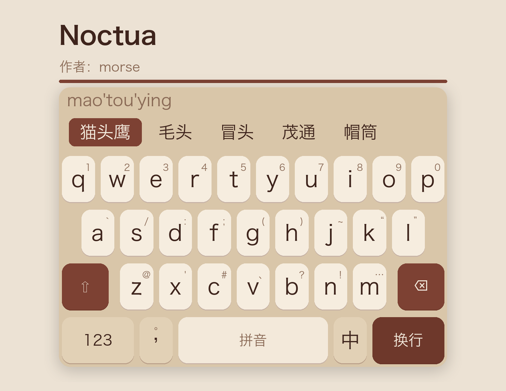

# Noctua

以猫头鹰风扇（<https://www.noctua.at/cn>）的经典配色为灵感设计的这款皮肤。
配色的唯一依据是 `资料/noctua_nf_a20_1.png`——NF-A20 的官方产品图，
皮肤里的每一个棕、每一个米都是从那张图上取样来的，不是凭印象调的。



这套皮肤是三份模板拼出来的：

| 来源 | 拿了什么 |
| --- | --- |
| `Skins/彩虹` | **拼音键盘的版面**（iPhone 26 键四行、iPad 全键盘五行），以及带立体下边缘的键帽、工具栏区向上渐隐这两处做法 |
| `Skins/Gboard` | **数字 / 符号 / 九宫格三种键盘的版面**，以及 `Components/` 下那套「角色 → 样式」的骨架（Button / Keys / Theme / Style） |
| `Skins/胭云` | 「色板集中在一个文件、README 就是配色说明书」的组织方式 |

一句话概括这套皮肤要还原的东西：

> **米色的会上屏，沙色的换状态，棕色的最重要。**

那只风扇的面积大头是米白的框体，棕色只出现在扇叶与四角的减震垫上。
照搬到键盘上就是：字母、数字、符号一律米白；123 / 中英 / ?123 / 返回这类
改变键盘状态的键用一档介于底板与键面之间的沙色；整块键盘上**棕色的键只有三颗**
——Shift、删除、回车。棕多了就腻，这是从原图上读出来的比例，不是省事。

---

## 一 配色

**改配色只需要动 `jsonnet/Constants/Palette.libsonnet` 里的八个基色**，其余十几个颜色
（按下态、立体下边缘、分割线、候选栏、气泡）全部由它们算出来，不会出现
「底色改了、按下态还是旧色」这种对不上的情况。

```jsonnet
local base = {
  canvas:       pair('#D9C6A9', '#1B1512'),  // 键盘底板
  letterFill:   pair('#F6EDDF', '#453930'),  // 米键：字母 / 数字 / 符号 / 空格
  functionFill: pair('#E2D1B6', '#322A24'),  // 沙键：123 / 中英 / ?123 / 返回 / 标点
  brown:        pair('#7D4133', '#8E5142'),  // 主棕：Shift、删除、候选首选
  brownDeep:    pair('#6E382B', '#743A2E'),  // 深棕：回车
  label:        pair('#3E241C', '#F0E3D0'),  // 键面主字
  labelMuted:   pair('#8A6A56', '#B49B81'),  // 角标 / 预编辑 / 候选注释
  labelOnBrown: pair('#F6EDDF', '#F4E7D5'),  // 棕色键面上的字
};
```

每个色都是一对 `{ light, dark }`，上层代码一律只写色名，
到 `main.jsonnet` 最后一步才把整棵配置树 `resolve` 成具体色值，
所以除 `Palette.libsonnet` 外**任何地方都不需要关心当前是深色还是浅色**。

### 浅色取自哪里

`资料/noctua_nf_a20_1.png` 上的取样点：

| 部位 | 取样 | 落到皮肤里 |
| --- | --- | --- |
| 扇框（四周那圈米白） | `#E9DAC7` / `#EAD5C0` | 键面 `letterFill`（提亮一档，键才浮得起来） |
| 扇叶受光面 | `#7D4133` | 主棕 `brown`，原样搬 |
| 角垫与轮毂 | `#6E382B` / `#73392B` | 深棕 `brownDeep`，原样搬 |

底板 `canvas` 是扇框米往下压一档压出来的：键面若与底板同色，整块键盘就是一片糊的米，
键的边界全靠那道立体下边缘撑着，太单薄。压开之后明度关系是
**底板 < 沙键 < 空格 < 米键**，四档，一眼就分得出哪颗会上屏。

### 深色取自哪里

深色模式没有官方参照。取的是 Noctua **chromax.black** 那条线的读法：黑棕色的机身 + 原本的棕。
于是底板发黑（`#1B1512`，带棕味的近黑，不是中性灰）、键面是暖棕灰、
两档棕反而比浅色**更亮**——暗底上的棕不提亮就压不住，会整个沉下去。

> **深色下最容易出事的一处是沙键与底板的明度差。** 沙键本来就夹在底板与键面之间，
> 两头各让一点就会贴上底板，而暗处的明度差本来就比亮处难分。
> 改 `canvas` 或 `functionFill` 之后，**务必出一张深色预览图确认这一档还看得出边界**
> ——初版就在这里翻过一次车（`#1E1814` 配 `#2B231E`，123 键整个化在底板里）。

### 派生规则

| 派生色 | 怎么算 | 说明 |
| --- | --- | --- |
| 米键 / 沙键按下 | **向主棕混** 16% / 20%（深色 26% / 30%） | 见下面「按下为什么是向棕靠而不是压黑」 |
| 棕键按下 | 浅色压黑 16~18%，深色提白 14~16% | 棕键自己没法再向棕靠，只能走老规矩 |
| 立体下边缘 | 浅色向 `#5A2C20` 混 30%，深色向黑混 45% | 深色底本来就暗，再掺棕就看不见了 |
| 空格 | 键面色向底板退一成 | 它是一整条不是一颗键，退一档才读得出是另一块地方 |
| 分割线 | 底板色掺两成主字色 | 九宫格符号条里的横线、纵排候选栏的分隔线 |
| 候选序号 | 次要文字色向底板退三成半 | 候选条上「候选字 > 注释 > 序号」三档轻重 |

唯一不从这八个基色派生的是**投影色**（`hintShadow`）：投影是黑的，与配色无关，
浅深两档的差别只在 alpha（`38` / `73`）——底板越暗，投影要越实才看得出来。
换配色时不必动它。

### 按下为什么是向棕靠而不是压黑

常见做法是「浅色向黑压一档、深色向白提一档」。那样做按下去的键会**掉出这套暖色**：
浅色下的米键压黑变成灰米，深色下的棕灰键提白变成冷白，一按就露馅。

这里改成一条规则通吃两边：**按下 = 向扇叶棕混一档**。

- 浅色的米键起点亮（`#F6EDDF`），主棕比它暗，混进去就变暗；
- 深色的棕灰键起点暗（`#453930`），而深色的主棕（`#8E5142`）比它亮，混进去反而提亮。

两边都是「离常态更远一档」，且始终留在棕色家族里——按下去的键仍然是这只风扇上的颜色。

### 键盘整体背景：画，但顶边渐隐

与 Gboard 那套「整块不画底、透出系统键盘背景」的做法相反，本皮肤**把底板实实在在画出来**
——Noctua 的框体色是这套皮肤的半条命，不画就只剩几颗棕键，认不出是它了。

代价是要自己处理 iOS 26 的老问题：系统从那一版起在键盘顶部加了一段带圆角的高度，
底板色一路铺到顶边会在那圈圆角处撞出一条色差。解法照搬「彩虹」，自下而上分三段：

| 区域 | 底 |
| --- | --- |
| 按键区 | 纯底板色 |
| 工具栏区 | 底板色 → 渐隐色，自下而上 |
| 预编辑区 | 整条都是渐隐色（alpha `03`，约 0.01） |

三段颜色连续，最上方那一条几乎全透明，圆角处就看不出边界了。
整条渐变**只降 alpha、不动色相**：渐变两端若换了 RGB（比如收到纯白），
中段 alpha 还高的地方会整体偏向那个颜色，浮出一条发白的带子。
采样点按 `smoothstep(3t²-2t³)` 取五个，两端都平滑收口——取两个点的线性渐变
能在起点看到一条淡淡的界线。

---

## 二 布局

四种键盘、五份版面：

| 键盘 | 文件 | 版面 | 来源 |
| --- | --- | --- | --- |
| 拼音（iPhone） | `Keyboards/iPhonePinyin.libsonnet` | 26 键四行 | 彩虹 |
| 拼音（iPad） | `Keyboards/iPadPinyin.libsonnet` | 全键盘五行，键面双标签 | 彩虹 |
| 数字 | `Keyboards/Numeric.libsonnet` | 10 列数字 + 符号 | Gboard |
| 符号 | `Keyboards/Symbolic.libsonnet` | 10 列符号（类型名 `noctuaSymbolic`） | Gboard |
| 九宫格数字 | `Keyboards/NumberPad.libsonnet` | 左符号条 + 3×3 数字 + 右功能列 + 底部一行 | Gboard |

除 iPad 拼音外，**每一页都是四行**，宽度统一按 1125 的虚拟设计宽度分配，
一行内所有分子加起来正好 1125 就铺满。

### 拼音第四行为什么长这样

```
彩虹     123    ,    空格    中英    ⏎
Gboard   ?123  ☺/,   空格     。     ⏎
```

两者的取舍是同一笔账的两面：**中英切换是给一颗独立的键，还是塞进空格的上划手势**。

本皮肤按需求取「彩虹」这一套——中英切换是颗独立的键，好处是不用记手势，
代价是第四行匀不出位置给句号了，句号挪到逗号键的上划上（键面上标着它，
长按那颗键还能从 `，、；：“”` 六个全角标点里挑）。
空格的上划因此空了出来，给了次选上屏。

键面上下两个字都是**全角**的「。」「，」，送出去的却是半角的 `.` `,`，中文状态下由输入方案
转成全角——与 Gboard 那套句号键是同一个做法。键面跟中文标点看齐（半角逗号在一颗中文键上
显得瘦小），上屏交给方案转，英文状态下仍然出半角。

> **逗号键的角标横向居中，不走其余键那个右上角的位置。** 字母键的角标是挤在一个填满键面的
> 字母旁边，靠边站才不打架；逗号键的两个标点都只是蹲在全角框左下角的一个小点，
> 角标再顶到右上角，两个小点各站一边，读不出「上划出这个」这层关系。
> 对齐之后句号正落在逗号上方，一竖列两个标点，一眼看得出是一对。

#### 两个标点为什么真的在键的正中

全角标点的墨迹缩在方框左下角，行盒摆正了看着却偏左。`Button.libsonnet` 的 `inkOffsets`
把这一档偏心按字号折成 `insets` 反向补掉，两处再都给 `center.x = 0.5`，
于是落在键横向正中的是**墨迹**而不是行盒。

**「。」与「，」的补偿值不一样**（`-0.275em` / `-0.331em`）——两者缩在方框里的程度差
0.056em，共用一个值的话逗号会比句号偏左约 1.3pt（22.5pt 字号下约 4 个设备像素）。
实测结果：

| | 墨迹中心偏离键中心 |
| --- | --- |
| 「。」角标（9.5pt） | −0.06pt（−0.19 设备像素） |
| 「，」主标签（22.5pt） | −0.09pt（−0.27 设备像素） |
| 两者相差 | −0.03pt（−0.08 设备像素） |

> **这两个值跟着字体的排版惯例走，不是普适常数。** 量自 Hiragino Sans GB——它与 iOS 的
> PingFang SC 同属 GB 简体字体，全角标点都落在方框左下、右半留白。同机上的
> STHeiti Medium 却把全角标点**居中**放（实测 `x ≈ +0.005`），差了将近 0.3em。
> 本机没有 PingFang 字体文件，没能直接实测；真机上若看着这两个标点偏右，
> 把 `inkOffsets` 这两行往 0 调即可。

复核办法：用 `scripts/gen_demo.py` 的 `draw_keyboard()` 渲出全分辨率键面，按墨量加权求质心，
与键的横向中心比对。**取样带要避开键的立体下边缘**——那条横贯键面的深色条会把质心往
键中心拽，量出来的偏差只有真实值的一半。

| 键 | 点按 | 上划 | 下划 |
| --- | --- | --- | --- |
| `⇧` | Shift（有预编辑文本时是 `Esc` 重输） | Tab | Tab |
| 字母键 | 小写 | 角标上的符号 | — |
| `,` | 逗号 | 句号 | — |
| `123` | 切到数字键盘 | — | — |
| 空格 | 空格（键面写方案名，有预编辑文本时写「选定」） | 次选上屏 | — |
| 中英 | 切 RIME 的 `ascii_mode`（有预编辑文本时是次选上屏） | — | — |
| `⏎` | 回车（键面跟着 `returnKeyType` 写「换行 / 前往 / 发送」） | 换行 | — |

### 行高按「一行多高」给，不按「一整块多高」给

iPad 拼音是五行，其余三页是四行。若像别的皮肤那样直接写死整块键盘的高度，
iPad 上从拼音切到数字时行高会跳一大截——五行的高度摊给四行，键立刻变胖。

所以 `Constants/Metrics.libsonnet` 只定**行高**：

```jsonnet
rowHeight: {
  iPhone: { portrait: 54, landscape: 40 },
  iPad:   { portrait: 62, landscape: 82 },
},
height(device, orientation, rows):: self.rowHeight[device][orientation] * rows,
```

整块键盘的高度由 `height()` 乘出来。iPad 拼音那一页写成
「四行正常行高 + 一排矮数字行（竖 48 / 横 62）」，所以它下面四行与其余三页的行高分毫不差，
多出来的只是顶上那一排。**来回切键盘时键不会跳。**

### 边缘键的触摸区比显示区大

第二、三、四行两侧的键用 `size` 取触摸宽、`bounds` 取绘制宽：
触摸区一直延伸到屏幕边缘，显示区仍与其余键对齐，边缘键因此更好按。
长按面板的锚点算的是**显示区**的中心而不是触摸区的，否则靠边的键面板会偏。

### 九宫格的结构

上块占 3/4 高、下块一行占 1/4，所以九宫格的行高与其余三页完全一致。
上块是一个 `HStack` 里塞三个 `VStack`（引擎的命名与直觉相反：`HStack` 是行、`VStack` 是列，
但**嵌套是自由的**）：

```
┌──────┬─────────────────┬──────┐
│ 符号 │  1    2    3    │  %   │
│ 列表 │  4    5    6    │  ␣   │   ← 上块 3/4
│      │  7    8    9    │  ⌫   │
├──────┴─────────────────┴──────┤
│ 返回  ,  !?#   0   =  .   ⏎   │   ← 下块 1/4
└───────────────────────────────┘
```

左边那条沙色符号列表是引擎自带的集合视图（`type: numericSymbols`），
内容取自 App 内「数字键盘符号」设置，皮肤能定的只有背景、内边距与分隔线色。

底部那一行里的 `!?#` 按角色本该是沙键，这里覆盖成了米键：
它左右两边（逗号、`0`）都是键，三颗沙键连成一片就分不出哪颗会上屏，
覆盖之后这一行的沙色只留在两端。

### 键盘之间怎么跳

```
拼音 ──123──> 数字 ──=\<──> 符号 noctuaSymbolic
                │   <──?123──     │
                └──12·34──> 九宫格 <──12·34──┘
                               │
                               └──!?#──> 引擎自带的分类符号键盘
   三页的「返回」都一步跳回主键盘（拼音）
   自带那块符号键盘有它自己的「返回」，退回九宫格
```

「返回」用的是 `returnPrimaryKeyboard` 而不是 `returnLastKeyboard`：后者弹的是键盘类型栈，
连跳几页之后按一次只退一格，要连按好几次才回得到拼音。主键盘是哪一个由用户设置决定。

### 符号页为什么不叫 `symbolic`

引擎在「`keyboardType == symbolic` **且皮肤没有声明 `symbolic`**」时，会挂上自带的分类符号键盘
（`KeyboardUI/.../KeyboardView+Layout.swift` 的 `layoutInternalSymbolic` → `SymbolicView`，
带分类栏、锁定按钮和它自己的「返回」，皮肤配不了也不用配）。
皮肤一旦占用 `symbolic` 这个名字，那块键盘就永远出不来。

所以本皮肤这一页挂在自定义类型 **`noctuaSymbolic`** 下，腾开之后两套符号键盘各走各的：
数字页的 `=\<` 进本皮肤这一页，九宫格的 `!?#` 进引擎自带的那一块。

类型名不在 `Keyboard.KeyboardType` 枚举里时，引擎按 `.custom(named:)` 处理
（`HamsterKit/.../Keyboard+KeyboardType.swift` 的 `from(identifier:)`），所以自定义名字是合法的。
`main.jsonnet` 里 `builders` 那张表的**键就是键盘类型 id**：config.yaml 按它分组、
按键的 `action: { keyboardType: ... }` 写它、产物文件名也由它派生，想再加一页只要往表里添一行。

---

## 三 几处细节

### 回车键不接条件样式，也不接通知

键面写的是 `$returnKeyType`，引擎按当前输入框替换成「换行 / 前往 / 搜索 / 发送 / 完成」，
但**底色一律是深棕，不随 `returnKeyType` 变**。

这不是偷懒。条件样式（`styleName` 数组）与通知混用时，通知把状态切回常态那一下
条件前景求不回来，那颗键会只剩一块空底色——Gboard 那边的回车键就栽在这上面。
既然深棕在任何场景下都是回车该有的分量，换色本来就没必要，索性把这一处的复杂度整个去掉。

> **通知节点必须把样式写全。** 引擎在通知生效期间是拿通知节点**当这颗键的样式节点**用的
> （`KeyboardRenderer.updateButtonLayer`）：它按节点里声明过的样式名收集 sublayer，
> 没收集到的当成多余的直接 `removeFromSuperlayer`。
> 所以通知里少写一个 `backgroundStyle`，键的背景层就会被清掉——
> 表现是「一打字，那颗键的底没了」。Shift、空格、中英三颗键的通知都把两项写全了。

### 大小写态只换主标签，角标照画

状态样式（`uppercasedStateForegroundStyle` / `capsLockedStateForegroundStyle`）给引擎的是
**整张前景表**，只写一个大写标签的话，一按 Shift 满键盘的角标会跟着消失。
`Button.new` 因此把副标签与角标一起拼进这两张表。

### 气泡的层次是两层做出来的

短按气泡浮在按键正上方，两者又是同一个米色，不做分界就看不出哪块是气泡、哪块是键面。
**单靠投影做不出来**：引擎给几何图层的投影路径是图层**底边那一道 1pt 的弧**
（`CAShapeLayer.underPath`，本来是给 iOS 那种立体下沿用的），一条 1pt 的线一模糊，
墨量摊开后峰值就没了。所以分两层：

| 层 | 参数 | 管哪一侧 |
| --- | --- | --- |
| 投影 | 半径 4、偏移 `(0, 3)` | 收紧压成底边一道实线，管「下沿」 |
| 描边 | 0.5pt，底板色掺三成主字色 | 管左右和上方 |

长按符号网格的面板用同一套做法。

### 长按弹出的备选符号

字母键长按弹一条面板，手指左右滑动改选、抬手上屏，当前那一格底是主棕。
字母键一律**三格**：角标（数字 / 符号）+ 小写 + 大写。

**角标一定落在默认高亮的那一格。** 手指一按下去，底下亮着的就是这颗键右上角标着的那个字符，
抬手即出，与上划同结果；要小写或大写再往左右挪一格。剩下两格里，
大写排到离角标**最远**的那一端，小写填中间：

| 角标落在 | 排法 | 哪些键 |
| --- | --- | --- |
| 最左格 | `1 q Q` | `q` `w` `a` |
| 正中格 | `E 3 e` | `e` `r` `t` `y` `u` `i` 与二、三行大部分键 |
| 最右格 | `O o 9` | `o` `p` `l` |

默认高亮哪一格**看键位，不看顺序**：面板比键宽得多，贴着屏幕边的键，面板会被引擎推回屏内
（`TouchView+HintSymbolsGrid` 里那两段 bounds 夹取），此时若还默认选中间那格，
高亮就落到手指外面去了。所以越靠左的键越往左选，阈值取在相邻两颗键中心的正中间。
**排内容与定高亮共用 `Button.anchorCol`**，改了键宽或行首偏移两边会一起动，不会走岔。

数字 / 符号 / 九宫格 / iPad 拼音四页没有配长按备选：那几页的键面本身就是符号表，
再叠一层是重复。

### 标点为什么要单独摆一次

引擎摆的是文字图层，对齐的是字形的**行盒**（ascent + descent），不是墨迹。
`。` 的小圆缩在全角方框的左下角、`,` 蹲在基线上，行盒摆正了，看着却偏左偏下。

`Components/Button.libsonnet` 的 `inkOffsets` 存着「墨迹中心相对行盒中心」的偏移（单位 em，
量自 Hiragino Sans GB / Heiti SC / SF Pro），`paint` 按字号折成点值再转成 `insets` 反向挪回来。
凡是走 `paint` 的地方（键面、角标、长按网格里的格子）都自动补，不必逐处去记。
用 `insets` 不用 `center`，是因为 `center` 是比例，键宽随屏幕变，同一个比例到 iPad 上会过头一倍。

### 引擎做不到的一处

**横排候选之间画不出分隔线**：`separatorColor` 只对纵排候选栏（`verticalCandidates`）生效。
所以横排这一条上只靠首选那颗棕色药丸分主次。

---

## 四 目录结构与构建

```
Noctua/
├── Makefile
├── README.md                  ← 你正在看的这份，也是配色的说明书
├── demo.png                   ← 由 scripts/gen_demo.py 从编译产物生成
├── 资料/
│   └── noctua_nf_a20_1.png    ← 唯一的配色依据
├── scripts/
│   └── gen_demo.py            ← 从编译产物生成 demo.png
└── jsonnet/
    ├── main.jsonnet           ← 入口：声明要出哪些文件
    ├── Constants/             ← 数据，不含逻辑
    │   ├── Palette.libsonnet    有哪些颜色（换配色只改这个文件）
    │   ├── Colors.libsonnet     这些颜色怎么用（按键角色表）
    │   ├── Fonts.libsonnet      字号
    │   └── Metrics.libsonnet    行高、间距、圆角
    ├── Components/            ← 通用构件，不知道有哪些键盘
    │   ├── Style.libsonnet      样式节点构造 + 深浅色解析（不依赖任何模块）
    │   ├── Theme.libsonnet      角色 → 样式名与样式节点，以及顶边渐隐
    │   ├── Button.libsonnet     按键构造，收敛全部命名规则
    │   ├── Keys.libsonnet       米键 / 沙色标点键的构造器 + 宽度表
    │   ├── FunctionKeys.libsonnet 功能键，外观 + 动作 + 通知收在一处
    │   ├── Layout.libsonnet     HStack / VStack 语法糖
    │   ├── Preedit.libsonnet    预编辑区
    │   └── Toolbar.libsonnet    工具栏与横 / 纵候选栏
    └── Keyboards/             ← 一种版面一个文件，只写表
        ├── iPhonePinyin.libsonnet
        ├── iPadPinyin.libsonnet
        ├── Numeric.libsonnet
        ├── Symbolic.libsonnet
        └── NumberPad.libsonnet
```

依赖方向是单向的：`Constants ← Components ← Keyboards ← main`，没有环。
`Style.libsonnet` 不 import 任何东西，与仓库里其他皮肤的同名文件逐字相同。

**没用到的样式不写进产物。** `Style.prune` 在出文件前扫一遍，
把没有任何地方引用的样式节点丢掉，所以加角色不会让每份产物都跟着变胖。

### 常用命令

```bash
make compile    # 只编译出 config.yaml / light/ / dark/
make validate   # 编译后跑结构校验，查「引用了不存在的样式」这类会让按键静默变空白的问题
make preview    # 编译后渲染预览图，查「某行没铺满」这类校验器看不出的几何问题
make build      # 打包成 build/Noctua.cskin，可直接安装
```

在手机上改皮肤时，长按皮肤选择「运行 main.jsonnet」即可重新编译。

### 换一套配色

改 `jsonnet/Constants/Palette.libsonnet` 里 `base` 的八行，重新 `make build` 即可。
`Components/` 与 `Keyboards/` 下的代码一律不必碰，`demo.png` 也会跟着新配色重新生成
（`python3 scripts/gen_demo.py`，它的板底色、标题色、那条强调色细线都是从编译产物里读的）。
改完记得按上面「深色取自哪里」那段的提醒，出一张深色预览图核一眼沙键与底板还分不分得开。
