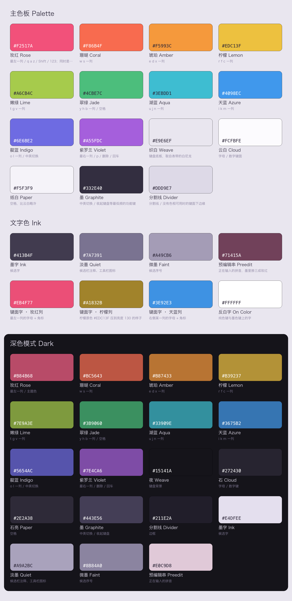

## 彩虹

根据 Apple Watch「Pride Edition 彩虹回环式运动表带」与同款彩虹表盘作为创作灵感，设计这款皮肤。

配色取自 `资料/` 目录中的表带实拍：那是一条**白色尼龙织带**，彩虹以竖条纹的方式织在上面，
每一条都被白纱压过一层，所以颜色艳而不刺。皮肤沿用这个结构——大面积留白，
颜色只出现在细节与两侧，并且**一颗键取哪一档颜色只看它在键盘上的水平位置**。

---

## 色板预览



> 这张图由 `scripts/gen_palette.py` 从下方三张表格（主色板 / 文字色 / 深色模式）自动生成，
> 色值的唯一来源就是本文件。调整颜色后重新生成：
>
> ```bash
> cd Skins/彩虹 && python3 scripts/gen_palette.py
> ```
>
> 依赖 Pillow：`pip3 install Pillow`。

---

## 一 主色板

十档色相，顺序就是表带从左读到右的顺序，也是键盘从左排到右的顺序。
这十档同时对应 26 键键盘第一行的十颗字母键，所以「第几列」与「第几档颜色」是一回事。

| 序号 | 色名 | 十六进制 | 用在哪 |
| :--: | --- | --- | --- |
| 1 | 玫红 Rose | `#F2517A` | 最左一列 / q a z / Shift / 123；同时是主题色 |
| 2 | 珊瑚 Coral | `#F86B4F` | w s 一列 |
| 3 | 琥珀 Amber | `#F5993C` | e d x 一列 |
| 4 | 柠檬 Lemon | `#EDC13F` | r f c 一列 |
| 5 | 嫩绿 Lime | `#A6CB4C` | t g v 一列 |
| 6 | 翠绿 Jade | `#4CBE7C` | y h b 一列 / 空格 |
| 7 | 湖蓝 Aqua | `#3EBDD1` | u j n 一列 |
| 8 | 天蓝 Azure | `#4098EC` | i k m 一列 |
| 9 | 靛蓝 Indigo | `#6E6BE2` | o l 一列 / 中英切换 |
| 10 | 紫罗兰 Violet | `#A55FDC` | 最右一列 / p / 删除 / 回车 |

**中性色**

| 色名 | 十六进制 | 用在哪 |
| --- | --- | --- |
| 织白 Weave | `#E9E6EF` | 键盘底板，取自表带的白尼龙 |
| 云白 Cloud | `#FCFBFE` | 字母 / 数字键面 |
| 纸白 Paper | `#F5F3F9` | 空格，比云白略冷 |
| 墨 Graphite | `#332E40` | 中英切换 / 收起键盘等最低频的功能键 |
| 分割线 Divider | `#DDD9E7` | 分割线 / 没有色相可用时的键面下边缘 |

### 文字色

白键面上的字不是一个色，而是十个：**一颗键的字母（或数字）与它右上角的上划符号同色**，
都是所在列的色相——看到什么颜色的字母，上划出来的就是那个颜色的符号。

十档原色的亮度差得很远（柠檬 192，靛蓝 122），当底色用没问题，当字色就不行：
同一行里柠檬那颗会淡到看不清，靛蓝那颗又重得发黑。所以键面字统一压到同一个亮度
（浅色 130、深色 170，`Palette.libsonnet` 的 `setLuma`），十列的字看起来才一样重。

| 色名 | 十六进制 | 用在哪 |
| --- | --- | --- |
| 墨字 Ink | `#413B4F` | 候选字 |
| 淡墨 Quiet | `#7A7391` | 候选栏注释、工具栏图标 |
| 微墨 Faint | `#A49CB6` | 候选序号 |
| 预编辑串 Preedit | `#71415A` | 正在输入的拼音，墨里掺三成玫红 |
| 键面字 · 玫红列 | `#EB4F77` | 最左一列的字母 + 角标 |
| 键面字 · 柠檬列 | `#A1832B` | 柠檬原色 `#EDC13F` 压到亮度 130 的样子 |
| 键面字 · 天蓝列 | `#3E92E3` | 右侧某一列的字母 + 角标 |
| 反白字 On Color | `#FFFFFF` | 纯色键与墨色键上的字 |

---

## 二 区域映射

这套皮肤的用色规则和仓库里另外两套（莫吉托、胭云）不一样。那两套是一条深浅渐变，
按键属于哪个角色就定死了颜色；本皮肤把问题拆成正交的两问：

| 问 | 由什么决定 |
| --- | --- |
| **色相**：取彩虹里的哪一档 | 只看这颗键的**水平中心**，与它是什么键、在第几行无关 |
| **处理**：这一档色怎么用 | 由按键的角色决定：白键面 / 纯色 / 淡彩 / 墨色 |

五种处理各自的配色规则（`h` 表示该列的色相，`mix(a, b, t)` 表示两色按比例混合）：

| 处理 | 用在哪些键 | 常态底色 | 按下底色 | 下边缘 | 常态字色 | 按下字色 |
| --- | --- | --- | --- | --- | --- | --- |
| 白键面 plain | 字母 / 数字 / 标点 | 云白 | `mix(云白, h, 12%)` | `mix(云白, h, 38%)` | `h` 调到亮度 130 | 再压 22% |
| 空格 space | 空格 | 纸白 | 同上 | 同上 | 同上 | 同上 |
| 纯色 solid | Shift / 删除 / 回车 / 运算符 | `h` | `mix(h, 黑, 12%)` | 同按下色 | 反白 | 纯白 |
| 淡彩 pale | 123 / #+= / 返回 / Tab / 翻页 | `mix(云白, h, 20%)` | `mix(云白, h, 32%)` | 同按下色 | 同白键面的按下字色 | 同常态 |
| 墨色 stone | 中英切换 / 收起键盘 / 地球 | `mix(墨, h, 15%)` | 加重一档 | 同按下色 | 反白 | 纯白 |

> 角标（键面右上角的上划符号）不单独给色：`Colors.libsonnet` 的白键面一档没写 `inkSoft`，
> `Theme` 于是退回主标签的字色。**主标签与上划符号永远同色**，这是这套皮肤最直接的一条提示——
> 键面上那个颜色，就是上划会出来的那个符号的颜色。

区域配色：

| 键盘区域 | 常态底色 | 常态字色 |
| --- | --- | --- |
| 按键区背景 | `#E9E6EF` | — |
| 工具栏区背景 | `#E9E6EF` 向上渐隐至 `#E9E6EF03` | 图标 `#7A7391`，按下 `#EB4F77` |
| 预编辑区背景 | `#E9E6EF03` | `#71415A` |
| 候选栏背景 | 同工具栏区 | 候选字 `#413B4F`、注释 `#7A7391`、序号 `#A49CB6` |
| 候选栏选中项 | `#F2517A`（玫红药丸） | 候选字 `#FFFFFF`、注释 `#FFFFFFCC`、序号 `#FFFFFFA6` |
| 候选栏点住 | `#FBE7EE`（淡玫红） | 同常态 |
| 短按气泡 | `#FCFBFE`，边框 `#DDD9E7` | `#413B4F` |

> **预编辑区与候选栏这一条上不放色相。** 它是整片彩虹里唯一一段要连着读的文本，
> 十个颜色轮着上会读不下去，所以只按「候选字 > 注释 > 序号」分三档轻重，
> 颜色全留给首选那颗玫红药丸。预编辑串是个例外：墨里掺三成玫红，
> 与下面那颗药丸遥相呼应，同时仍比候选字轻。点住某个候选字时透出一层淡玫红，
> 与按键「按下才开出颜色」是同一套手感。

> **键盘上半部不铺满底板色。** iOS 26 起系统会在键盘顶部强制加一段带圆角的高度，
> 底板色若一路铺到顶边，会在那圈圆角处与系统背景撞出一条色差。所以自下而上分三段：
> 按键区是纯底板色 `#E9E6EF`，工具栏区由它向上渐隐到 `#E9E6EF03`（末两位是透明度，
> 约 0.01），预编辑区整条都是 `#E9E6EF03`。三段颜色连续，最上方几乎全透明，
> 圆角处就看不出边界了。深色模式同理，底板色换成 `#15141A`。
>
> 渐隐色是**底板色本身压低透明度**，不是白色也不是黑色——渐变只降 alpha、不动色相，
> 否则中段 alpha 还高的地方会整体偏向那个颜色，深色底板上会浮出一条发黑的带子。
> 这也是它不在色板里单列的原因：由 `Theme.libsonnet` 从底板色派生，改底板色自动跟着变。
>
> 横排候选栏与工具栏同占一块地方，用同一份渐变；纵排候选栏展开后盖住工具栏区 +
> 按键区，渐隐带被压回原本工具栏所占的那一段高度里。

---

## 三 深色模式

深色模式保留同一组色相，压低明度与饱和，整体落到「夜里发光的那条织带」。
十档色相各自换一个深色原值，五种处理的规则不变，只是混合方向反过来——
浅色向黑压的地方，深色一律向白提。

| 色名 | 十六进制 | 用在哪 |
| --- | --- | --- |
| 玫红 Rose | `#B84B68` | 最左一列 / 主题色 |
| 珊瑚 Coral | `#BC5643` | w s 一列 |
| 琥珀 Amber | `#B87433` | e d x 一列 |
| 柠檬 Lemon | `#B39237` | r f c 一列 |
| 嫩绿 Lime | `#7E9A3E` | t g v 一列 |
| 翠绿 Jade | `#3B9060` | y h b 一列 / 空格 |
| 湖蓝 Aqua | `#33909E` | u j n 一列 |
| 天蓝 Azure | `#3675B2` | i k m 一列 |
| 靛蓝 Indigo | `#5654AC` | o l 一列 / 中英切换 |
| 紫罗兰 Violet | `#7E4CA6` | 最右一列 / 删除 / 回车 |
| 夜 Weave | `#15141A` | 键盘背景 |
| 石 Cloud | `#272430` | 字母 / 数字键 |
| 石亮 Paper | `#2E2A38` | 空格 |
| 墨 Graphite | `#443E56` | 中英切换 / 收起键盘 |
| 分割线 Divider | `#211E2A` | 边框 |
| 墨字 Ink | `#E4DFEE` | 候选字 |
| 淡墨 Quiet | `#A9A2BC` | 候选栏注释、工具栏图标 |
| 微墨 Faint | `#8B84A0` | 候选序号 |
| 预编辑串 Preedit | `#E0C9D8` | 正在输入的拼音 |

> 深色模式下「淡彩」这一档只往键面色里掺两成色相（浅色模式是两成、按下三成二不变）。
> 掺多了黄与橙会糊成一块土褐色，是打样时看图改出来的一档。
>
> 键面字同样统一亮度，只是方向反过来：浅色模式把色相压到 130，深色模式提到 170，
> 于是石色键上的十列字是一排亮度相同的粉彩，不会有哪一列糊进底色里。

---

## 四 色值落到代码里的位置

上面三张表被翻译成 `jsonnet/Constants/Palette.libsonnet`，那里是编译时的唯一色值来源。

与另外两套皮肤不同的是，本文件**只写十档色相的原色**，衍生色由规则算出来：

```jsonnet
// 每档色相只写这一对，其余十几种衍生色由 hue() 按第二节的规则算
rose: hue('#F2517A', '#B84B68'),   // 玫红，主题色
```

因为十档色相 × 每档五六种衍生色 = 四十多个十六进制，手写抄错一位很难看出来；
写成规则以后，改一档色相只需要动一行，整套按键跟着重排。混合用的 `mix()`
只用到 `std.codepoint` / `std.format` 这类最老的内置函数，手机上的 jsonnet 也吃得下。

「哪个色用在哪」在 `jsonnet/Constants/Colors.libsonnet`，它把第二节那张处理表写成代码，
再用两重循环乘出 **5 种处理 × 10 档色相 = 50 个按键角色**：

```jsonnet
roles: {
  [roleName(treatment, hue)]: treatments[treatment](P.hues[hue])
  for treatment in std.objectFields(treatments)
  for hue in P.order
}
```

角色名就是「处理 + 色相」，例如 `plainAzure`（天蓝那一列的白键面）、`solidViolet`
（最右一列的纯紫功能键）。一份键盘只用得到其中十来个，其余由 `Style.prune` 在出文件前丢掉。

键盘文件不直接点名颜色，只报位置：

```jsonnet
FunctionKeys.shift(shiftName, at('solid', 2, 0), widths.shift)
//                            ↑ 第三行第一颗键 -> 水平中心 0.075 -> 玫红
```

位置由 `Layout.centers()` 从**宽度表**算出来，不额外维护第二张表，
所以改宽度、加减键之后条纹自动跟着重排，不会对不上。

> 改色只需要动 `Palette.libsonnet` 与 `Colors.libsonnet` 两个文件，
> `Components/` 与 `Keyboards/` 下的代码一律不必碰。

---

## 五 配色使用原则

1. **色相跟着位置走，不跟着功能走。** 同一颗功能键放在键盘左边和右边就该是两个颜色。
   于是 Shift 接着最左一列的玫红、删除与回车接着最右一列的紫罗兰，
   整块键盘从左到右是一条不断的竖条纹——这是表带织纹的样子。
2. **字母区永远是云白。** 十个颜色只出现在键面上的字与线上——主标签、与它同色的角标、
   下边缘那道细线——底色始终留白。大面积的白尼龙是表带的底，也是这套配色能用十个颜色还不吵的原因。
3. **按下时整颗键才开出颜色。** 白键按下透出 12% 的色相，是这套皮肤唯一一次让色块铺满键面；
   连成一片就是一道彩虹（见 `build/preview/preview_light_pinyinPortrait_pressed.png`）。
4. **按下态 = 常态色加深约 12% 明度**，不换色相；深色模式反过来提亮 12%。
5. **最重的墨色只用在低频键上。** 中英切换、收起键盘、地球键——它对应表带上那两条
   黑与棕的包容色条。墨里掺一成半所在列的色相，深色块也跟着竖条纹走。
6. **底板色不要碰到键盘顶边。** 工具栏区往上渐隐、预编辑区整条透明，把键盘顶边让给系统的
   圆角背景，见第二节表格下的说明。

---

## 六 键盘布局

已覆盖拼音与数字两种键盘、各四种场景，`config.yaml` 由编译自动生成：

| 键盘 | 设备 / 方向 | 文件 | 布局 |
| --- | --- | --- | --- |
| 拼音 | iPhone 竖屏 / 横屏 | `pinyinPortrait` / `pinyinLandscape` | 26 键四行，字母键带上划角标 |
| 拼音 | iPad 竖屏 / 横屏 | `iPadPinyinPortrait` / `iPadPinyinLandscape` | 全键盘五行，键面上标 + 下标 |
| 拼音 | iPad 浮动 | 复用 `pinyinPortrait` | 同 iPhone 竖屏 |
| 数字 | iPhone 竖屏 | `numericPortrait` | 九宫格单栏 |
| 数字 | iPhone 横屏 | `numericLandscape` | 九宫格 + 右侧分类符号面板 |
| 数字 | iPad 竖屏 / 横屏 | `iPadNumericPortrait` / `iPadNumericLandscape` | 同上双栏 |

> `numeric` 一项同时供 `numeric` 与 `numberPad` 两种键盘类型使用。

布局本身就写成表格，加键、换上划符号、调宽度都只改表，不动代码。
`jsonnet/Keyboards/iPhonePinyin.libsonnet` 的第一张表长这样：

```jsonnet
// [字母, 上划符号]。上划符号同时是键面右上角的角标与气泡里的上划提示。
local letterRows = [
  [['q', '1'], ['w', '2'], ['e', '3'], /* …… */ ['p', '0']],
  [['a', '`'], ['s', '/'], ['d', ':'], /* …… */ ['l', '”']],
  [['z', '@'], ['x', "'"], ['c', '#'], /* …… */ ['m', '…']],
];
```

第二张表是宽度，按 1125 的虚拟设计宽度分配，一行内分子加起来正好 1125 就铺满：

```
第一行 10 × 112.5                          = 1125
第二行 168.75 + 7 × 112.5 + 168.75          = 1125
第三行 168.75 + 7 × 112.5 + 168.75          = 1125
第四行 225 + 112.5 + 空格 450 + 112.5 + 225 = 1125
```

第三张表是同一套宽度的相对分子（1 = 112.5/1125），交给 `Layout.centers()` 算出每颗键的
水平中心——色带就是从这里来的。两张表分开写是因为引擎要的是分数字符串，
而算中心要的是数字，合成一张反而更绕。

### 数字键盘

九宫格分五列，宽度 17 / 22 / 22 / 22 / 17，加起来正好 100：

| 列 | 内容 | 色相 |
| --- | --- | --- |
| 1（窄） | 符号列表（占四分之三高）+ `#+=` | 玫红 |
| 2 | 1 / 4 / 7 / 返回 | 琥珀 |
| 3 | 2 / 5 / 8 / 0 | 翠绿 |
| 4 | 3 / 6 / 9 / 空格 | 天蓝 |
| 5（窄） | 删除 / `.` / `=` / 回车 | 紫罗兰 |

配色沿用第五节原则 2：彩色只落在最外两列，中间三列数字保持云白。

这里的色带**按整块九宫格算，不按整屏算**：横屏与 iPad 上九宫格只占左半屏，
若按整屏算，十档彩虹会被挤进左边 45%，右半的符号面板反而没有颜色可分；
按九宫格自己算，竖屏与横屏的同一颗键颜色还一致。

屏幕够宽时（横屏、iPad）右半边再挂一块分类符号面板，左右各占 45%，中间留 10% 的空隙。
这两块面板的内容由引擎自己填（符号取自 App 内的「数字键盘符号」设置），
皮肤能定的只有背景、内边距与分隔线色——它们的 `cellStyle` 引擎读了但不用，所以没写。

> `#+=` 切到符号键盘。本皮肤没有定义 `symbolic`，此时用的是引擎内置的符号键盘，
> 观感与本皮肤不一致。要接上的话，照 `Keyboards/Numeric.libsonnet` 的写法加一个
> `Keyboards/Symbolic.libsonnet`，再在 `main.jsonnet` 的产物矩阵与 `config` 里各加一项即可。

### 几个已经接好的交互

- **上划**：字母键上划出角标里的符号；空格上划次选上屏；回车上划换行；Shift 上下划发 Tab。
- **随状态换装**：回车键跟着系统 `returnKeyType` 在紫罗兰 / 玫红之间切换并改文案；
  中英切换键跟着 RIME 的 `ascii_mode` 换图标；有预编辑文本时空格显示「选定」、Shift 显示「Esc」。
- **短按气泡**：字母键弹出大写字母，右上角带上划符号提示。
- **按下缩放**：所有按键按下时整键缩到 92%（40ms）并保持，抬起用 90ms 弹回。
  参数在 `Components/Theme.libsonnet` 的 `pressAnimation`；某一颗键不要动画就给它传 `animation: []`。

### 三处与「色相跟着位置走」的取舍

- **回车的强调态**：`returnKeyType` 是「前往 / 发送 / 完成」时不跟位置走，点名主题色玫红。
  它是全键盘唯一一颗会自己换色相的键，靠的就是这个反差。
- **数字键盘的等号**：最右列已经是一条紫罗兰，`=` 再取紫就分不出主次，所以也点名玫红，
  它是那块键盘上唯一的重色。
- **Shift 大写锁定**：引擎只支持切换前景样式，不支持切换背景，所以锁定态保持同一档底色，
  只把图标换成 `capslock.fill` 并提亮到纯白。

---

## 七 目录结构与构建

```
彩虹/
├── Makefile
├── README.md                  ← 你正在看的这份，也是色值的说明书
├── demo.png                   ← 由 scripts/gen_demo.py 从编译产物生成
├── 资料/                       ← 表带实拍与色板预览图
├── scripts/
│   ├── gen_palette.py         ← 从本文件的三张表生成色板预览图
│   └── gen_demo.py            ← 从编译产物生成 demo.png
└── jsonnet/
    ├── main.jsonnet           ← 入口：声明要出哪些文件
    ├── Constants/             ← 数据，不含逻辑
    │   ├── Palette.libsonnet    有哪些颜色（十档色相 + 派生规则）
    │   ├── Colors.libsonnet     这些颜色怎么用（处理 × 色相 = 按键角色表）
    │   ├── Fonts.libsonnet      字号
    │   └── Metrics.libsonnet    高度、间距、圆角
    ├── Components/            ← 通用构件，不知道有哪些键盘
    │   ├── Style.libsonnet      样式节点构造 + 深浅色解析（不依赖任何模块）
    │   ├── Theme.libsonnet      角色 → 样式名与样式节点
    │   ├── Button.libsonnet     按键构造，收敛全部命名规则
    │   ├── FunctionKeys.libsonnet 功能键，每个键的外观 + 动作 + 通知收在一处
    │   ├── Layout.libsonnet     HStack / VStack 语法糖 + 色带位置计算
    │   ├── Preedit.libsonnet    预编辑区
    │   └── Toolbar.libsonnet    工具栏与横 / 纵候选栏
    └── Keyboards/             ← 一种键盘一个文件，只写表
        ├── iPhonePinyin.libsonnet
        ├── iPadPinyin.libsonnet
        └── Numeric.libsonnet
```

依赖方向是单向的：`Constants ← Components ← Keyboards ← main`，没有环。
`Style.libsonnet` 不 import 任何东西，可以整份搬到别的皮肤里用。

**深浅色只处理一次。** 所有构件都只写色名（`{ light, dark }` 一对），
到 `main.jsonnet` 最后一步才把整棵配置树 `resolve` 成具体色值，
于是 `isDark` 不必作为参数穿过每一个函数。

**没用到的样式不写进产物。** 本皮肤有 50 个按键角色，一份键盘只用得到十来个。
`Style.prune` 在出文件前扫一遍，把没有任何地方引用的样式节点丢掉，
所以加色相、加处理不会让每份产物都跟着变胖。

### 常用命令

```bash
make compile    # 只编译出 config.yaml / light/ / dark/
make validate   # 编译后跑结构校验，查「引用了不存在的样式」这类会让按键静默变空白的问题
make preview    # 编译后渲染预览图，查「某行没铺满」这类校验器看不出的几何问题
make build      # 打包成 build/彩虹.cskin，可直接安装
```

在手机上改皮肤时，长按皮肤选择「运行 main.jsonnet」即可重新编译。

### 换一条彩虹

`jsonnet/Constants/Palette.libsonnet` 里那十行就是整套配色：

```jsonnet
hues: {
  rose: hue('#F2517A', '#B84B68'),
  ...
}
```

改其中一行，那一列的键面字、角标、下边缘、按下色会一起跟着变。
想让条纹更宽（相邻几颗键同色）就删掉几档，`order` 里剩几档就分几条竖纹，
键盘文件与其余代码都不必动。

### 加一个分号键

`jsonnet/main.jsonnet` 顶部：

```jsonnet
local addSemicolon = false;   // 改成 true，第二行末尾会多出一个分号键
```

打开后第二行变成 10 个键，`a` 与 `l` 不再加宽，色带也会自动按新的宽度重排。
