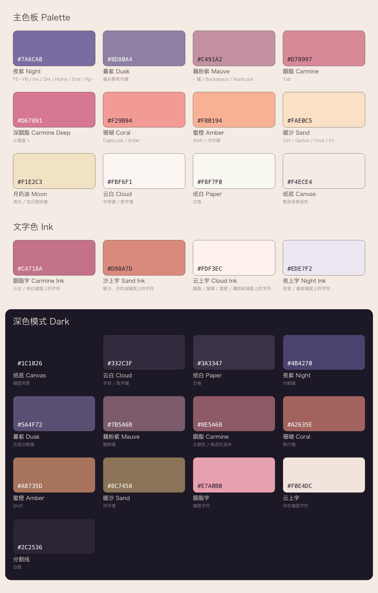

## 胭云

根据 Nuphy「胭云」键帽的配色作为创作灵感，设计这款皮肤。

配色取自 `资料/` 目录中的键帽实拍与官方渲染图，通过对每颗键帽顶面像素取样（去除阴影与高光后取中位色），再统一做屏幕显示补偿（亮度 +8%）得到下列色板。

---

## 色板预览



> 这张图由 `scripts/gen_palette.py` 从下方三张表格（主色板 / 文字色 / 深色模式）自动生成，
> 色值的唯一来源就是本文件。调整颜色后重新生成：
>
> ```bash
> cd Skins/胭云 && python3 scripts/gen_palette.py
> ```
>
> 依赖 Pillow：`pip3 install Pillow`。

---

## 一 主色板

整套配色是一条**「由夜入昼」的暮云渐变**：从左上角的夜紫，经胭脂玫红、日落珊瑚，过渡到右下角的暖沙米黄，中间用云白作留白。

| 序号 | 色名 | 十六进制 | 采样来源 | 说明 |
| :--: | --- | --- | --- | --- |
| 1 | 夜紫 Night | `#7A6CA0` | F5–F8 / Ins / Del / Home / End / PgUp / PgDn | 最深的一档，暮色天幕 |
| 2 | 暮紫 Dusk | `#8D80A4` | 最右侧弯月键 | 夜紫的柔化版 |
| 3 | 藕粉紫 Mauve | `#C491A2` | `~` 键 / Backspace / NumLock | 紫向粉的过渡 |
| 4 | 胭脂 Carmine | `#D78997` | Tab | 皮肤主题色，取自「胭云」之「胭」 |
| 5 | 深胭脂 Carmine Deep | `#D67891` | 小键盘 `+` | 胭脂的加重色，用于强调 |
| 6 | 珊瑚 Coral | `#F29B94` | CapsLock / Enter | 日落主光 |
| 7 | 蜜橙 Amber | `#F8B194` | Shift / 方向键 | 霞光 |
| 8 | 暖沙 Sand | `#FAE0C5` | Ctrl / Option / Cmd / Fn | 最浅的一档，沙滩暖调 |
| 9 | 月奶油 Moon | `#F1E2C3` | 满月 / 弦月图标键 | 点缀色 |
| 10 | 云白 Cloud | `#FBF6F1` | 字母键 / 数字键 | 主键面 |
| 11 | 纸白 Paper | `#F8F7F0` | 空格 | 比云白略冷 |
| 12 | 纸底 Canvas | `#F4ECE4` | 整体背景纸色 | 键盘底板 |

### 文字色

| 色名 | 十六进制 | 用法 |
| --- | --- | --- |
| 胭脂字 Carmine Ink | `#C4718A` | 云白 / 纸白键面上的字符 |
| 沙上字 Sand Ink | `#D98A7D` | 暖沙、月奶油键面上的字符 |
| 云上字 Cloud Ink | `#FDF3EC` | 胭脂 / 珊瑚 / 蜜橙 / 藕粉紫键面上的字符 |
| 夜上字 Night Ink | `#EDE7F2` | 夜紫 / 暮紫键面上的字符 |

---

## 二 区域映射

按元书皮肤的键盘分区，建议如下分配（沿用键帽「越靠外越深、越靠中越浅」的规律）：

| 键盘区域 | 常态底色 | 常态字色 | 按下底色 | 按下字色 |
| --- | --- | --- | --- | --- |
| 按键区背景 | `#F4ECE4` | — | — | — |
| 工具栏区背景 | `#F4ECE4` 向上渐隐至 `#F4ECE403` | — | — | — |
| 预编辑区背景 | `#F4ECE403` | `#C4718A` | — | — |
| 候选栏背景 | 同工具栏区 | `#C4718A` | — | — |
| 候选栏选中项 | `#D78997` | `#FDF3EC` | — | — |
| 字母 / 数字键 | `#FBF6F1` | `#C4718A` | `#F0DCDC` | `#B0607A` |
| 空格 | `#F8F7F0` | `#C4718A` | `#EFE4DC` | `#B0607A` |
| Shift（未激活） | `#F8B194` | `#FDF3EC` | `#EC9A78` | `#FFFFFF` |
| Shift（大写锁定） | `#F29B94` | `#FDF3EC` | `#E08079` | `#FFFFFF` |
| 删除键 | `#C491A2` | `#FDF3EC` | `#AE7A8D` | `#FFFFFF` |
| 换行 / 回车键 | `#F29B94` | `#FDF3EC` | `#E08079` | `#FFFFFF` |
| 符号 / 切换键 | `#FAE0C5` | `#D98A7D` | `#EFCBA9` | `#C4705F` |
| 中英切换 / 功能键 | `#7A6CA0` | `#EDE7F2` | `#665A88` | `#FFFFFF` |
| 数字键盘运算符 | `#D67891` | `#FDF3EC` | `#BE6480` | `#FFFFFF` |
| 分割线 / 边框 | `#E7D9CE` | — | — | — |

> **键盘上半部不铺满底板色。** iOS 26 起系统会在键盘顶部强制加一段带圆角的高度，
> 底板色若一路铺到顶边，会在那圈圆角处与系统背景撞出一条色差。所以自下而上分三段：
> 按键区是纯底板色 `#F4ECE4`，工具栏区由它向上渐隐到 `#F4ECE403`（末两位是透明度，
> 约 0.01），预编辑区整条都是 `#F4ECE403`。三段颜色连续，最上方几乎全透明，
> 圆角处就看不出边界了。深色模式同理，底板色换成 `#1C1826`。
>
> 渐隐色是**底板色本身压低透明度**，不是白色也不是黑色——渐变只降 alpha、不动色相，
> 否则中段 alpha 还高的地方会整体偏向那个颜色，深色底板上会浮出一条发黑的带子。
> 这也是它不在色板里单列的原因：由 `Theme.libsonnet` 从底板色派生，改底板色自动跟着变。
>
> 横排候选栏与工具栏同占一块地方，用同一份渐变；纵排候选栏展开后盖住工具栏区 +
> 按键区，渐隐带被压回原本工具栏所占的那一段高度里。

---

## 三 深色模式

深色模式保留同一组色相，压低明度、降低饱和，整体落到「夜幕下的胭云」：

| 对应亮色 | 深色值 | 用途 |
| --- | --- | --- |
| 纸底 Canvas | `#1C1826` | 键盘背景 |
| 云白 Cloud | `#332C3F` | 字母 / 数字键 |
| 纸白 Paper | `#3A3347` | 空格 |
| 夜紫 Night | `#4B4270` | 功能键 |
| 暮紫 Dusk | `#5A4F72` | 次级功能键 |
| 藕粉紫 Mauve | `#7B5A6B` | 删除键 |
| 胭脂 Carmine | `#8E5A68` | 主题色 / 候选栏选中 |
| 珊瑚 Coral | `#A2635E` | 换行键 |
| 蜜橙 Amber | `#A8735D` | Shift |
| 暖沙 Sand | `#8C7458` | 符号键 |
| 胭脂字 | `#E7A0B0` | 键面字符 |
| 云上字 | `#F0E4DC` | 深色键面字符 |
| 分割线 | `#2C2536` | 边框 |

---

## 四 色值落到代码里的位置

上面三张表已经被翻译成 `jsonnet/Constants/Palette.libsonnet`，那里是编译时的唯一色值来源：

```jsonnet
{
  night:   { light: '#7A6CA0', dark: '#4B4270' },  // 夜紫
  carmine: { light: '#D78997', dark: '#8E5A68' },  // 胭脂
  cloud:   { light: '#FBF6F1', dark: '#332C3F' },  // 云白
  // …… 共 30 个色，每个都是 { light, dark } 一对
}
```

「哪个色用在哪」则在 `jsonnet/Constants/Colors.libsonnet`，它把上面第二节的区域映射表
写成了一张**按键角色表**——一行一个角色，改一行就换掉一整类按键的配色：

```jsonnet
roles: {
  //          底色         按下底色           下边缘       字色          按下字色
  letter: { fill: P.cloud, pressed: P.cloudPressed, edge: P.divider, ink: P.inkCarmine, inkPressed: P.inkCarminePressed },
  shift:  { fill: P.amber, pressed: P.amberPressed, edge: P.amberPressed, ink: P.inkCloud, inkPressed: P.inkWhite },
  // ……
}
```

> 改色只需要动 `Palette.libsonnet` 与 `Colors.libsonnet` 两个文件，
> `Components/` 与 `Keyboards/` 下的代码一律不必碰。

---

## 五 配色使用原则

1. **同一行内不要出现两个跨度过大的色阶。** 键帽原设计里，每一行的功能键颜色都是相邻色阶（如 Tab 胭脂 → CapsLock 珊瑚 → Shift 蜜橙 → Ctrl 暖沙），自上而下逐行变暖。
2. **字母区永远是云白。** 所有彩色只出现在两侧功能键与顶行，中央保持大面积留白，这是「云」的部分。
3. **紫色只用在最顶部。** 夜紫、暮紫对应键帽的 F 功能行与导航键，在皮肤中留给顶部功能条 / 中英切换等低频键。
4. **按下态 = 常态色加深约 10%~12% 明度**，不换色相，保持整体柔和。
5. **底板色不要碰到键盘顶边。** 工具栏区往上渐隐、预编辑区整条透明，把键盘顶边让给系统的圆角背景，见第二节表格下的说明。

---

## 六 键盘布局

已覆盖拼音与数字两种键盘、各四种场景，`config.yaml` 由编译自动生成：

| 键盘 | 设备 / 方向 | 文件 | 布局 |
| --- | --- | --- | --- |
| 拼音 | iPhone 竖屏 / 横屏 | `pinyinPortrait` / `pinyinLandscape` | 26 键四行，字母键带上划角标 |
| 拼音 | iPad 竖屏 / 横屏 | `iPadPinyinPortrait` / `iPadPinyinLandscape` | 全键盘五行，键面上标 + 下标 |
| 拼音 | iPad 浮动 | 复用 `pinyinPortrait` | 同 iPhone 竖屏 |
| 数字 | iPhone 竖屏 | `numericPortrait` | 九宫格单栏 |
| 数字 | iPhone 横屏 | `numericLandscape` | 九宫格 + 右侧分类符号面板 |
| 数字 | iPad 竖屏 / 横屏 | `iPadNumericPortrait` / `iPadNumericLandscape` | 同上双栏 |

> `numeric` 一项同时供 `numeric` 与 `numberPad` 两种键盘类型使用。

布局本身就写成表格，加键、换上划符号、调宽度都只改表，不动代码。
`jsonnet/Keyboards/iPhonePinyin.libsonnet` 的第一张表长这样：

```jsonnet
// [字母, 上划符号]。上划符号同时是键面右上角的角标与气泡里的上划提示。
local letterRows = [
  [['q', '1'], ['w', '2'], ['e', '3'], /* …… */ ['p', '0']],
  [['a', '`'], ['s', '/'], ['d', ':'], /* …… */ ['l', '”']],
  [['z', '@'], ['x', "'"], ['c', '#'], /* …… */ ['m', '…']],
];
```

第二张表是宽度，按 1125 的虚拟设计宽度分配，一行内分子加起来正好 1125 就铺满：

```
第一行 10 × 112.5                          = 1125
第二行 168.75 + 7 × 112.5 + 168.75          = 1125
第三行 168.75 + 7 × 112.5 + 168.75          = 1125
第四行 225 + 112.5 + 空格 450 + 112.5 + 225 = 1125
```

### 数字键盘

九宫格分五列，宽度 17 / 22 / 22 / 22 / 17，加起来正好 100：

| 列 | 内容 |
| --- | --- |
| 1（窄） | 符号列表（占四分之三高）+ `#+=` |
| 2 | 1 / 4 / 7 / 返回 |
| 3 | 2 / 5 / 8 / 0 |
| 4 | 3 / 6 / 9 / 空格 |
| 5（窄） | 删除 / `.` / `=` / 回车 |

配色沿用第五节原则 2：彩色只落在最外两列，中间三列数字保持云白。
`=` 用第二节表里的「数字键盘运算符」深胭脂，是整块键盘上唯一的重色。

屏幕够宽时（横屏、iPad）右半边再挂一块分类符号面板，左右各占 45%，中间留 10% 的空隙。
这两块面板的内容由引擎自己填（符号取自 App 内的「数字键盘符号」设置），
皮肤能定的只有背景、内边距与分隔线色——它们的 `cellStyle` 引擎读了但不用，所以没写。

> `#+=` 切到符号键盘。本皮肤没有定义 `symbolic`，此时用的是引擎内置的符号键盘，
> 观感与本皮肤不一致。要接上的话，照 `Keyboards/Numeric.libsonnet` 的写法加一个
> `Keyboards/Symbolic.libsonnet`，再在 `main.jsonnet` 的产物矩阵与 `config` 里各加一项即可。

### 几个已经接好的交互

- **上划**：字母键上划出角标里的符号；空格上划次选上屏；回车上划换行；Shift 上下划发 Tab。
- **随状态换装**：回车键跟着系统 `returnKeyType` 在珊瑚 / 深胭脂之间切换并改文案；
  中英切换键跟着 RIME 的 `ascii_mode` 换图标；有预编辑文本时空格显示「选定」、Shift 显示「Esc」。
- **短按气泡**：字母键弹出大写字母，右上角带上划符号提示。
- **按下缩放**：所有按键按下时整键缩到 92%（40ms）并保持，抬起用 90ms 弹回。
  参数在 `Components/Theme.libsonnet` 的 `pressAnimation`；某一颗键不要动画就给它传 `animation: []`。

### 两处与色板的取舍

- **Shift 大写锁定**：引擎只支持切换前景样式，不支持切换背景，所以第二节表里
  「Shift（大写锁定）用珊瑚」改为保持蜜橙底色、把图标换成 `capslock.fill` 并提亮到纯白。
- **中英切换键用夜紫**：这一颗是第四行里唯一的深色块，与相邻的珊瑚回车键色阶跨度偏大，
  和第五节原则 1 有张力。这里选择遵从第二节的区域映射表——它对应键帽套装里最深的导航键，
  读起来是有意为之的锚点。想让整行更柔和，把 `Colors.libsonnet` 里 `functional` 角色的
  `P.night` 换成 `P.dusk` 即可。

---

## 七 目录结构与构建

```
胭云/
├── Makefile
├── README.md                  ← 你正在看的这份，也是色值的说明书
├── demo.png                   ← 由 scripts/gen_demo.py 从编译产物生成
├── 资料/                       ← 键帽实拍与色板预览图
├── scripts/
│   ├── gen_palette.py         ← 从本文件的三张表生成色板预览图
│   └── gen_demo.py            ← 从编译产物生成 demo.png
└── jsonnet/
    ├── main.jsonnet           ← 入口：声明要出哪些文件
    ├── Constants/             ← 数据，不含逻辑
    │   ├── Palette.libsonnet    有哪些颜色
    │   ├── Colors.libsonnet     这些颜色怎么用（按键角色表）
    │   ├── Fonts.libsonnet      字号
    │   └── Metrics.libsonnet    高度、间距、圆角
    ├── Components/            ← 通用构件，不知道有哪些键盘
    │   ├── Style.libsonnet      样式节点构造 + 深浅色解析（不依赖任何模块）
    │   ├── Theme.libsonnet      角色 → 样式名与样式节点
    │   ├── Button.libsonnet     按键构造，收敛全部命名规则
    │   ├── FunctionKeys.libsonnet 功能键，每个键的外观 + 动作 + 通知收在一处
    │   ├── Layout.libsonnet     HStack / VStack 语法糖
    │   ├── Preedit.libsonnet    预编辑区
    │   └── Toolbar.libsonnet    工具栏与横 / 纵候选栏
    └── Keyboards/             ← 一种键盘一个文件，只写表
        ├── iPhonePinyin.libsonnet
        ├── iPadPinyin.libsonnet
        └── Numeric.libsonnet
```

依赖方向是单向的：`Constants ← Components ← Keyboards ← main`，没有环。
`Style.libsonnet` 不 import 任何东西，可以整份搬到别的皮肤里用。

**深浅色只处理一次。** 所有构件都只写色名（`{ light, dark }` 一对），
到 `main.jsonnet` 最后一步才把整棵配置树 `resolve` 成具体色值，
于是 `isDark` 不必作为参数穿过每一个函数。

**没用到的样式不写进产物。** 通用构件是按「全套角色」生成的，
但一份键盘往往只用到其中几个——数字键盘没有 Shift，也不弹气泡。
`Style.prune` 在出文件前扫一遍，把没有任何地方引用的样式节点丢掉，
所以加角色、加构件不会让每份产物都跟着变胖。

### 常用命令

```bash
make compile    # 只编译出 config.yaml / light/ / dark/
make validate   # 编译后跑结构校验，查「引用了不存在的样式」这类会让按键静默变空白的问题
make preview    # 编译后渲染预览图，查「某行没铺满」这类校验器看不出的几何问题
make build      # 打包成 build/胭云.cskin，可直接安装
```

在手机上改皮肤时，长按皮肤选择「运行 main.jsonnet」即可重新编译。

### 加一个分号键

`jsonnet/main.jsonnet` 顶部：

```jsonnet
local addSemicolon = false;   // 改成 true，第二行末尾会多出一个分号键
```

打开后第二行变成 10 个键，`a` 与 `l` 不再加宽。
